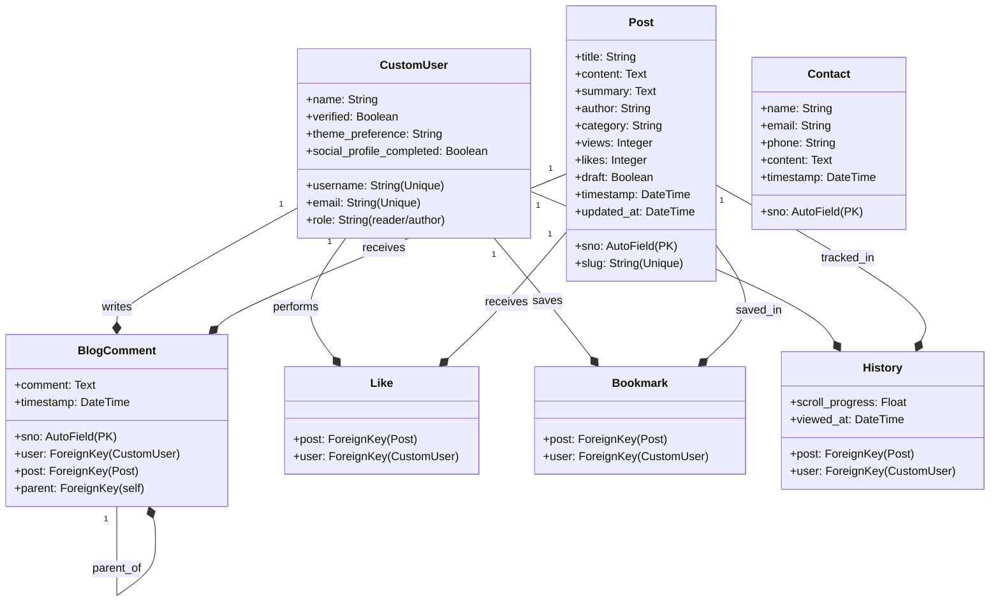

# Articlio - Architecture and Developer Guide

This document describes the technical architecture, data design, and optimized background components of Articlio. It is intended for developers and maintainers of the platform.

---

## 1. System Architecture Overview

Articlio is built as a robust, secure, and customizable blogging application leveraging Django. The stack is separated into:
- **Backend Core**: Django 5.2 (MVC architecture using standard django templates).
- **Frontend / Styling**: Tailwind CSS, PostCSS (build configuration), JavaScript, Custom CSS.
- **Database**: SQLite for development and PostgreSQL (hosted on Supabase) for production.
- **Caching Layer**: Local/Memory cache containing optimized Bloom Filters for speed.
- **Third-Party Auth**: Integrated `django-allauth` for seamless OAuth login via Google and GitHub.

---

## 2. Database Schema and Models

The application database is divided into two primary Django apps: `home` (handles accounts, contact logic, preferences) and `blog` (handles posts, interactions, user history).



### Table Reference

| Model | Application | Description | Important Constraints |
| :--- | :--- | :--- | :--- |
| `CustomUser` | `home` | Overrides standard User. Handles roles, themes, verification, and OAuth completion tags. | Inherits `AbstractUser` |
| `Post` | `blog` | Represents a blog entry. Tracks views, drafts, likes, and reading metrics. | `slug` must be unique. |
| `BlogComment` | `blog` | Reusable recursive comment structure allowing nested replies. | ForeignKey to `self` |
| `Like` | `blog` | Represents post likes by users. | Unique combination: `(post, user)` |
| `Bookmark` | `blog` | Allows users to save posts to their reading list. | Unique combination: `(post, user)` |
| `History` | `blog` | Captures reading metrics, including scroll progress percentages. | Unique combination: `(post, user)` |
| `Contact` | `home` | Feedback and inquiry submission registry. | Auto timestamps |

---

## 3. Bloom Filter for Username Validation

To make the user registration process highly responsive, Articlio features a custom **Bloom Filter** layer cached in memory to inspect if a username is already taken.

```
                  ┌─────────────────────────────┐
                  │   User Enters Username      │
                  └──────────────┬──────────────┘
                                 ▼
                  ┌─────────────────────────────┐
                  │    Check Bloom Filter       │
                  └──────────────┬──────────────┘
                                 │
                ┌────────────────┴────────────────┐
                ▼ (False)                         ▼ (True)
     ┌─────────────────────┐            ┌─────────────────────┐
     │  DEFINITELY FREE    │            │     MIGHT BE TAKEN  │
     │  (Instantly Allow)  │            │     (Do DB Query)   │
     └─────────────────────┘            └──────────┬──────────┘
                                                   │
                                     ┌─────────────┴─────────────┐
                                     ▼ (Exists)                  ▼ (Does Not Exist)
                          ┌─────────────────────┐      ┌─────────────────────┐
                          │   SHOW TAKEN ERR    │      │   ALLOW REGISTRATION│
                          └─────────────────────┘      └─────────────────────┘
```

### How it Works
1. **Instantiation**: The bloom filter is initialized with a size of $100,000$ bits and 3 hashing functions. This yields a false positive rate of less than $1\%$.
2. **Custom Hashing Functions**: Prime numbers (`31`, `37`, `41`) are used as seeds. The hash values wrap around using modulo arithmetic matching the bit array size:
   $$h(s, \text{seed}) = \left(\sum_{i=1}^{n} \text{ord}(s[i]) \times \text{seed}^i \right) \bmod \text{size}$$
3. **Caching**: The filter is stored in Django’s cache (`username_bloom_filter`). If the cache expires or restarts, it rebuilds instantly on the first query by polling user rows using `.values_list('username', flat=True)`.
4. **Synchronization**: A Django `post_save` signal on the `CustomUser` model updates the Bloom Filter whenever a new user accounts is created.

> [!NOTE]
> Bloom filters do not support deletions. In the rare case of a username modification or account removal, the old username remains flagged as 'taken' in the filter. This results in a false positive, causing the system to run a database query fallback which corrects the answer.

---

## 4. OAuth Authentication Flow & Adapters

We override standard behavior using custom adapters inside [adapters.py](file:///c:/Users/A%20K%20Shaikh/Documents/Projects/Articlio%20Blog/home/adapters.py):

### Account Auto-Link (`pre_social_login`)
Usually, if a user signs up using credentials and subsequently attempts to log in via Google/GitHub with the exact same email, standard Django frameworks trigger a duplicate email error page.
Articlio overrides this:
```python
def pre_social_login(self, request, sociallogin):
    # Auto-links social logins directly if they match an existing email account.
    ...
```
Since Google and GitHub verify email addresses, auto-connecting is safe and provides a frictionless login experience.

### First-Time Profiler (`ProfileCompletionMiddleware`)
1. When a user creates an account via Google or GitHub, the `ArticlioSocialAccountAdapter` sets `social_profile_completed = False`.
2. The user is redirected to the `/complete-profile/` page to select their user role (`reader` or `author`) and input a display name.
3. The custom `ProfileCompletionMiddleware` intercepts incoming requests: if an authenticated user has `social_profile_completed == False`, it locks navigation and redirects them to the completion screen (allowing only logout and static assets).

---

## 5. Dynamic Theming Engine

Articlio supports custom aesthetic themes that completely customize the user experience.

### Themes Catalog
Available themes are:
- 🔵 **Ocean** (Default)
- 🟢 **Emerald**
- 🔘 **Slate**
- 🔴 **Crimson**
- 🟣 **Violet**

The user's theme selection is persisted on the `CustomUser` database model (`theme_preference`).

### Email Client Theme Customizer
To maintain a high-quality user experience across all touchpoints, confirmation and password reset emails are themed using the user's active configuration.
- Theme hex colors are mapped under the `THEME_COLORS` dictionary in `home/utils.py`.
- The helper `send_verification_email` passes these active HSL/HEX variables to `templates/emails/verification_code.html` to output customized, brand-aligned HTML templates.

---

## 6. Security Architecture

### Content Security Policy (CSP)
The custom `CSPMiddleware` generates a random cryptographically secure token (nonce) for every incoming request:
```python
nonce = secrets.token_urlsafe(16)
request.csp_nonce = nonce
```
This nonce is injected into the response headers for `script-src` and `style-src` preventing unauthorized third-party scripts from executing, mitigating Cross-Site Scripting (XSS) risks.

### Clickjacking Defense
The system sets `frame-ancestors 'none';` via CSP, preventing unauthorized framing of the application pages.

---

## 7. Reader UX & Focus Mode Architecture

Articlio includes a rich client-side reading engine designed for high-focus, distraction-free consumption.

### Component Breakdown
- **DOM Workspace Isolation**: When Focus Mode is toggled, non-essential interface elements (`#main-nav`, footers, sidebar cards, recommendations, and comment sections) are temporarily hidden or transitioned out.
- **Content Width Bounds**: Users can toggle between `Narrow` (`36rem`), `Medium` (`48rem`), and `Wide` (`64rem`) layouts dynamically. The selection is stored in `localStorage` and applied instantly across post loads.
- **Reading Surface Themes**: Independent of global accent themes, Focus Mode provides reading surface presets (`Light`, `Sepia`, `Warm`, and `Dark`) with custom background tints and optimized typography contrast ratios.
- **Progress & Time Estimation**: Real-time listeners compute viewport scroll metrics against article length to display both a minimalist reading progress bar and a dynamic live estimation of remaining reading time (`~X min left`).

---

## 8. Text-to-Speech (TTS) Pipeline

To enhance accessibility and support on-the-go consumption, Articlio integrates a native browser-based audio engine.

### Implementation Details
- **Engine**: Built on top of the native HTML5 Web Speech API (`window.speechSynthesis` and `SpeechSynthesisUtterance`).
- **Sanitization & Text Extraction**: Prior to vocalization, post HTML contents are parsed to extract clean text blocks while filtering out hidden markers or raw code blocks.
- **Playback Controls**: Readers can toggle Play/Pause, jump forward/backward by block intervals, and adjust playback speeds ($0.75\times$ to $2.0\times$).
- **State Persistence & Clean Teardown**: The controller handles boundary events, audio pauses when navigating away, and synchronizes state across both standard and Focus Mode reader bars.
