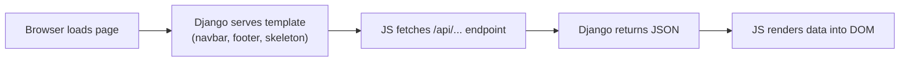

# CSR (Client-Side Rendering) Migration for Articlio Blog

Convert the Articlio blog from Django's server-side template rendering to a **CSR architecture** where pages load instantly with skeleton/shell UI, then fetch data via JSON APIs.

## Architecture Overview



**Key idea**: Django still serves the HTML templates (no SPA framework needed), but the templates ship with **empty content areas + skeleton loaders**. JavaScript `fetch()` calls populate data from new `/api/` endpoints after page load.

## User Review Required

> [!IMPORTANT]
> **Pages that will be converted to CSR:**
> 1. **Home page** (`/`) — top posts fetched via API
> 2. **Blog listing** (`/blog`) — all posts + filters fetched via API
> 3. **Blog post detail** (`/blog/<slug>`) — post content, comments, like/bookmark state via API
> 4. **Bookmarks** (`/blog/bookmarks`) — saved posts via API
> 5. **Search results** (`/search`) — results via API
> 6. **My Blogs** (`/blog/myBlogs`) — drafts/published via API
>
> **Pages that will stay SSR** (form-heavy, no benefit from CSR):
> - Login, Signup, Contact, About, Terms, Privacy, Write Blog, Email Verification, Forgot Password

> [!WARNING]
> **SEO Impact**: The blog post detail page currently has structured data (JSON-LD), meta tags, and content that search engines index. With pure CSR, search bots won't see the content. I recommend a **hybrid approach for blog post detail**: render the post content server-side (for SEO) but fetch comments, like state, and bookmark state client-side. This gives you the best of both worlds.

## Open Questions

1. **Blog post detail page**: Should we keep post content (title, body, meta tags) server-rendered for SEO, and only CSR the interactive parts (comments, likes, bookmarks)? **Recommended: Yes.**

2. **Skeleton design**: Should skeletons match the exact card layout (animated pulsing grey blocks), or a simpler loading spinner? **Recommended: Animated skeleton cards.**

3. **Error handling**: When an API call fails, should we show a "Retry" button, or redirect to an error page? **Recommended: Inline retry button.**

## Proposed Changes

### Backend: New API Endpoints

#### [NEW] [api_views.py](file:///c:/Users/A%20K%20Shaikh/Documents/Projects/Articlio%20Blog/blog/api_views.py)

New file with JSON API views that return data as `JsonResponse`:

- `api_posts(request)` — Returns all posts (with filter/sort params), author list, category list, and user's bookmarked post IDs
- `api_post_detail(request, slug)` — Returns post data, comments tree, like/bookmark state, related posts *(only if we want full CSR for this page)*
- `api_bookmarks(request)` — Returns user's bookmarked posts
- `api_my_blogs(request)` — Returns user's drafts and published posts
- `api_search(request)` — Returns search results

Each endpoint serializes model data to JSON manually (no DRF needed — simple `JsonResponse` + list comprehension).

#### [NEW] [api_views_home.py](file:///c:/Users/A%20K%20Shaikh/Documents/Projects/Articlio%20Blog/home/api_views.py)

- `api_home(request)` — Returns top posts
- `api_search(request)` — Returns search results with bookmarked IDs

---

#### [MODIFY] [urls.py](file:///c:/Users/A%20K%20Shaikh/Documents/Projects/Articlio%20Blog/blog/urls.py)

Add new `/api/` prefixed routes for each endpoint.

#### [MODIFY] [urls.py](file:///c:/Users/A%20K%20Shaikh/Documents/Projects/Articlio%20Blog/home/urls.py)

Add new `/api/` prefixed routes for home and search.

---

#### [MODIFY] [views.py](file:///c:/Users/A%20K%20Shaikh/Documents/Projects/Articlio%20Blog/blog/views.py)

Simplify existing views to render **empty shell templates** (no context data passed, except for `blogPost` which keeps SSR content for SEO). Auth checks remain server-side for protected pages.

#### [MODIFY] [views.py](file:///c:/Users/A%20K%20Shaikh/Documents/Projects/Articlio%20Blog/home/views.py)

Simplify `home` and `search` views to render empty shells.

---

### Frontend: Template + JavaScript Changes

#### [MODIFY] [base.html](file:///c:/Users/A%20K%20Shaikh/Documents/Projects/Articlio%20Blog/templates/base.html)

- Add a global CSS class for skeleton loading animations (`.skeleton-pulse`)
- Expose CSRF token as a JS variable for fetch calls

#### [MODIFY] [home.html](file:///c:/Users/A%20K%20Shaikh/Documents/Projects/Articlio%20Blog/templates/home/home.html)

- Replace `` loop with skeleton card placeholders
- Add JS that fetches `/api/home/posts` and renders cards into the DOM

#### [MODIFY] [blogHome.html](file:///c:/Users/A%20K%20Shaikh/Documents/Projects/Articlio%20Blog/templates/blog/blogHome.html)

- Replace server-rendered post grid + filter dropdowns with skeletons
- Add JS that fetches `/api/blog/posts?filter=...&authors=...&category=...` and renders the grid
- Filter changes trigger new fetch calls instead of form submissions

#### [MODIFY] [blogPost.html](file:///c:/Users/A%20K%20Shaikh/Documents/Projects/Articlio%20Blog/templates/blog/blogPost.html)

- **Keep post content SSR** (title, body, meta tags, JSON-LD) for SEO
- Convert comments section to CSR: skeleton → fetch `/api/blog/<slug>/comments`
- Convert like button state to CSR: fetch `/api/blog/<slug>/state` (returns liked/bookmarked/likes count)
- Convert related posts to CSR

#### [MODIFY] [bookmarkBlog.html](file:///c:/Users/A%20K%20Shaikh/Documents/Projects/Articlio%20Blog/templates/blog/bookmarkBlog.html)

- Replace server-rendered bookmarked posts with skeletons
- JS fetches `/api/blog/bookmarks`

#### [MODIFY] [search.html](file:///c:/Users/A%20K%20Shaikh/Documents/Projects/Articlio%20Blog/templates/home/search.html)

- Replace server-rendered results with skeletons
- JS fetches `/api/search?query=...`

#### [MODIFY] [myBlogs.html](file:///c:/Users/A%20K%20Shaikh/Documents/Projects/Articlio%20Blog/templates/blog/myBlogs.html)

- Replace server-rendered blog lists with skeletons
- JS fetches `/api/blog/my-blogs`

---

### Skeleton Loading CSS

Add to `base.html` `<style>`:
```css
/* Skeleton shimmer animation */
.skeleton {
    background: linear-gradient(90deg, #e5e7eb 25%, #f3f4f6 50%, #e5e7eb 75%);
    background-size: 200% 100%;
    animation: skeleton-shimmer 1.5s ease-in-out infinite;
    border-radius: 8px;
}
@keyframes skeleton-shimmer {
    0% { background-position: 200% 0; }
    100% { background-position: -200% 0; }
}
```

---

## Summary of New API Routes

| Endpoint | Method | Returns |
|---|---|---|
| `/api/home/posts` | GET | Top posts + bookmarked IDs |
| `/api/blog/posts` | GET | All posts + filters/authors/categories + bookmarked IDs |
| `/api/blog/bookmarks` | GET | User's bookmarked posts |
| `/api/blog/my-blogs` | GET | User's drafts + published posts |
| `/api/blog/<slug>/state` | GET | Like/bookmark state + comment count + related posts |
| `/api/blog/<slug>/comments` | GET | Full comment tree for a post |
| `/api/search` | GET | Search results + bookmarked IDs |

## Verification Plan

### Automated Tests
- Start dev server with `python manage.py runserver`
- Use browser tool to navigate to each page and verify:
  1. Page loads immediately with skeleton/loading state visible
  2. Data populates within ~500ms
  3. Filters, search, likes, bookmarks all work correctly
  4. Blog post SEO meta tags are present in initial HTML

### Manual Verification
- Test with both authenticated and unauthenticated users
- Test bookmark/like interactions still work with debouncing
- Verify no Django template errors or JS console errors
